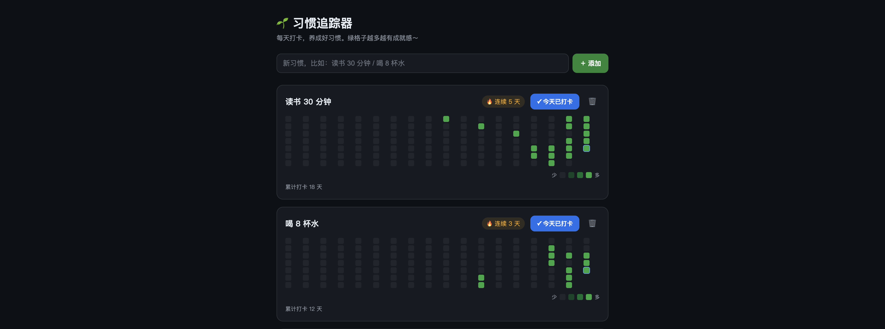

# 🌱 习惯追踪器 Habit Tracker

[](https://github.com/XuGuu/habit-tracker/actions/workflows/test.yml)
[](LICENSE)
[](#)

每天给习惯打卡，用一张「绿色热力图」（像 GitHub 主页的小方块）和「连续天数」激励自己坚持。
纯前端、零依赖、双击即用，数据存在本地。



## ✨ 功能

- ➕ **添加任意多个习惯**（读书、喝水、运动……）
- ✅ **一键打卡 / 取消**，记录每天是否完成
- 🔥 **当前连续天数**：自动计算你正坚持了几天
- 🏆 **历史最长连续天数**：让你看到自己最棒的时候，继续追平
- 🟩 **热力图**：展示最近约 17 周的打卡情况，绿格子越多越有成就感
- ✏️ **双击习惯名称**即可重命名
- 💾 **导出 / 导入 JSON**：换浏览器或电脑也不会丢数据
- 📊 **累计打卡天数**统计

## 🚀 使用

双击 `index.html` 用浏览器打开。输入习惯名 → 点「添加」→ 每天回来点「今天打卡」即可。

## 🛠 技术说明（给好奇的你）

- 纯 HTML + CSS + JavaScript，无框架。
- 每个习惯只记录「打过卡的日期」，热力图和连续天数都是即时算出来的。
- 数据存在浏览器 `localStorage` 里，不联网、不上传。
- 「连续天数」的小巧思：如果今天还没打卡，就从昨天开始数，这样不会因为「今天还没打」就显示中断。

## 🧪 跑测试

连续天数、最长记录、完成率统计、数据规范化等纯逻辑抽在 [`habit-logic.js`](habit-logic.js)，用 Node 内置测试框架覆盖，**无需安装任何依赖**：

```bash
node --test test_habit_logic.js
```

每次 push 时 GitHub Actions 会自动在 Node 18/20/22 上跑测试。

## 📜 更新日志

详见 [CHANGELOG.md](CHANGELOG.md)。

## 📄 许可证

MIT
